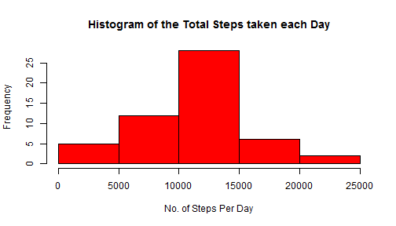
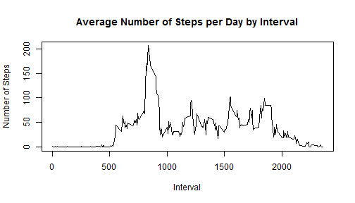
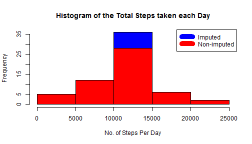
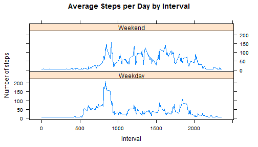

## Loading and preprocessing the data

```r
if(!file.exists('activity.csv')){
  unzip('activity.zip')
}
data <- read.csv("activity.csv", header=TRUE)
data$date <- as.Date(data$date, "%Y-%m-%d")
```

## What is mean total number of steps taken per day?

```r
daily_steps <- aggregate(steps ~ date, data, sum)

hist(daily_steps$steps, 
     col="red", 
     main="Histogram of the Total Steps taken each Day", 
     xlab="No. of Steps Per Day")
```

 

```r
mean_steps <- mean(daily_steps$steps)
median_steps <- median(daily_steps$steps)
```
* Mean Total Number of Steps: 1.0766189 &times; 10<sup>4</sup>
* Median Total Number of Steps:  10765

## What is the average daily activity pattern?

```r
interval_steps <- aggregate(steps ~ interval, data, mean)

plot(interval_steps$interval,
     interval_steps$steps, 
     type="l", 
     xlab="Interval", 
     ylab="Number of Steps",
     main="Average Number of Steps per Day by Interval")
```

 

```r
max_interval <- interval_steps[which.max(interval_steps$steps),1]
```

* Maximum Interval is 835

## Imputing missing values
The missing value is filled using the mean value per day (found above) divided by number of readings for a particular day. The total for that day is equivalent to the mean value per day.

```r
steps_na <- is.na(data$steps)
num_missing <- nrow(data[steps_na,])
```
* Number of missing values is 2304


```r
imputed_data <- data
for (i in which(is.na(imputed_data$steps), arr.ind = TRUE)) {
  d <- imputed_data[i,2]
  n <- count(imputed_data[imputed_data$date==d,])
	imputed_data[i,1] <- mean_steps/n
}

imputed_daily_steps <- aggregate(steps ~ date, imputed_data, sum)

hist(imputed_daily_steps$steps, 
     col="blue", 
     main="Histogram of the Total Steps taken each Day", 
     xlab="No. of Steps Per Day")

hist(daily_steps$steps, 
     col="red", 
     main="Histogram of the Total Steps taken each Day", 
     xlab="No. of Steps Per Day", 
     add=T)

legend("topright", c("Imputed", "Non-imputed"), col=c("blue", "red"), lwd=10)
```

 

```r
imputed_mean_steps <- mean(imputed_daily_steps$steps)
imputed_median_steps <- median(imputed_daily_steps$steps)
```

* Imputed Data Mean Total Number of Steps: 1.0766189 &times; 10<sup>4</sup>
* Imputed Data Median Total Number of Steps:  1.0766189 &times; 10<sup>4</sup>


## Are there differences in activity patterns between weekdays and weekends?

```r
weekend <- c("Saturday", "Sunday")
imputed_data$day = ifelse(is.element(weekdays(imputed_data$date), weekend), "Weekend", "Weekday")

interval_steps2 <- aggregate(steps ~ interval + day, imputed_data, mean)

xyplot(interval_steps2$steps ~ interval_steps2$interval | interval_steps2$day, 
       main="Average Steps per Day by Interval",
       type="l",
       xlab="Interval", 
       ylab="Number of steps",
       layout=c(1,2))
```

 
